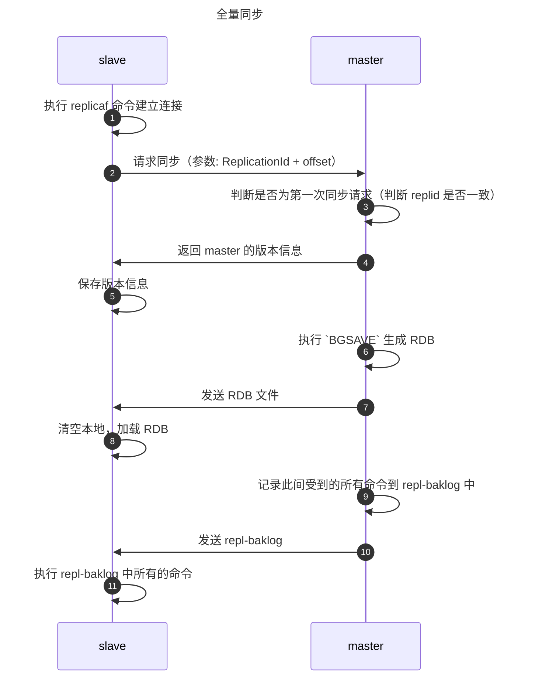
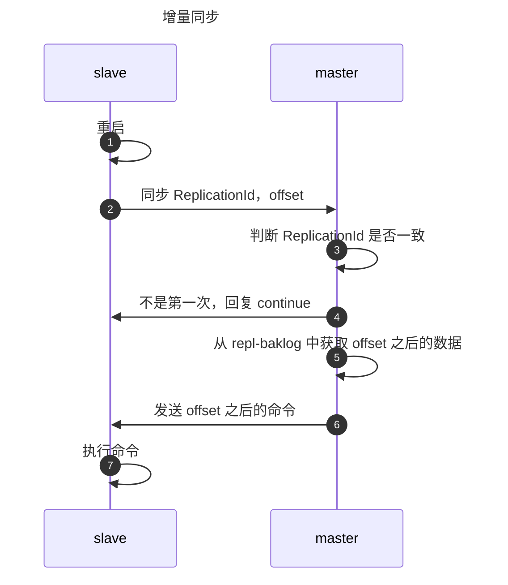

Redis 是非常常用的 key-value 数据库，使用内存以及 HashMap 进行存储的特点带来了高效的查询。本文将介绍 Redis 的持久化原理，集群的部署方式和键值对的过期淘汰机制。
<!-- more -->


## 持久化
Redis 的强大性能很大程度上由于其将所有的数据都存在了内存之中。但是在重启之后，内存的数据会全部丢失。在某些情况下，我们希望 Redis 的数据在重启后仍然不丢失，那么就涉及到 Redis 的持久化策略。一共提供两种持久化的策略: RDB 和 AOF，现在我们分别来看一下这两种策略的原理和优缺点。

### RDB
RDB 是基于快照的全量备份，周期性地把全量的数据写入快照文件。Redis 会在以下几种情况下对数据进行快照：
- 根据配置规则进行快照。

	用户可以在配置文件中自定义若干条规则，多条规则之间是"或"的关系。每个规则有两个参数：时间窗口 M 和更改的键的个数 N。例如：
	```text
	save 900 1
	save 300 10
	save 60 10000
	```
- 用户执行 `SAVE` 或者 `BGSAVE` 命令。

	- `SAVE`：执行该命令时 Redis 同步地进行快照操作，在此期间会阻塞所有来自客户端的请求。如果数据量巨大则会导致 Redis 在较长时间内无响应，所以应当避免在生产环境中使用该命令。
	- `BGSAVE`：当我们需要手动进行快照的时候推荐使用 `BGSAVE`。该命令可以在后台进行异步地生成快照。如果想知道是否完成，则可以使用 `LASTSAVE` 命令获取最近一次成功的快照时间戳。
- 执行 `FLUSHALL` 命令。

	执行该命令的时候 Redis 会清除数据库的所有数据。并且不论清空的过程中是否触发自动快照的条件，只要快照条件不为空，Redis 就会执行一次快照操作。但是如果没有定义自动快照条件，执行 `FLUSHALL` 的过程就不会进行快照。
- 执行复制（replication）时。

	当设置了[主从模式](#主从模式)后，Redis 会复制初始化时进行快照。

#### 快照原理
Redis 会默认将快照文件存储在 Redis 当前进程的工作目录中的 dump.rdb 文件中。
::: note 快照的路径和文件名可以通过 `dir` 和 `dbfilename` 两个参数来指定。
:::

快照的过程如下：

::: steps
1. Redis 使用 `fork` 函数复制一份当前进程（父进程）的副本（子进程）。
2. 父进程继续接收并处理客户端的请求，而子进程开始将内存中的数据写入硬盘中的临时文件。
3. 当子进程写入所有数据后会用该临时文件替换旧的 RDB 文件。**至此一次快照操作完成**。
:::

::: tip 在运行 `fork()` 函数时，Linux 会使用写时复制（copy-on-write）策略。当父进程要更改其中的数据时，操作系统会将该数据复制一份以保证子进程的数据不受影响。所以新的 RDB 文件存储的是运行 `fork()` 函数那一刻的内存数据。
:::

#### 优缺点
::: tip 优点
1. 恢复快。因为是全量数据直接恢复就好。
2. 主进程不进行 I/O，对节点影响小。
:::

::: warning 缺点
1. 丢失间隔。RDB 是快照文件，两个快照之间节点宕机会导致快照之间的修改会丢失。
2. 老版本无法兼容。RDB 文件格式与 Redis 的版本息息相关，不同版本可能无法使用相同的RDB进行恢复。
3. 设置的备份的间隔时间过长，RDB 太大的时候可能导致服务暂停。
:::

### AOF
AOF 策略是对内存修改进行指令记录。默认情况下 Redis 没有开启 AOF 策略，我们可以通过 `appendonly yes` 来启用。AOF 开启后，每执行一条会更改 Redis 数据的命令，Redis 就将该命令写入硬盘中的 AOF 文件，默认文件名为 appendonly.aof 文件。

#### 重写
当 AOF 文件达到一定条件时 Redis 会自动重写 AOF 文件。条件可以在配置文件中自定义：
```text
aoto-aof-rewrite-percentage 100
auto-aof-rewrite-min-size 64mb
```
`aoto-aof-rewrite-percentage` 参数的意义时当前的 AOF 文件大小超过上一次重写时的 AOF 文件大小的百分之几。`auto-aof-rewrite-min-size` 参数限制了允许重写的最小 AOF 文件大小。

::: tip 在重写的过程中 Redis 会删除冗余的命令。
:::

#### 优缺点
::: tip 优点
1. 不会出现数据丢失。

	由于操作系统的缓存机制，AOF 命令不会直接落盘，而是进入操作系统的缓存由操作系统来决定何时同步到磁盘中。我们可以通过 `appendfsync` 参数来设置同步策略：
	- appendfsync always
	- appendfsync everysec
	- appendfsync no

	其中 always 表示每次执行写入都会同步，是最慢也是最安全的。no 则表示完全由操作系统来决定同步时机，性能最好。但是一般我们会使用 everysec，这样平衡了性能和安全。

2. 没有磁盘寻址开销。因为日志是追加写入（append-only）。
3. 日志可读。该场景可以用于紧急恢复，例如误删了重要数据后，可以趁着文件还未更新前将 AOF 保存下来。
:::

::: warning 缺点
1. AOF 日志比 RDB 更大。因为 AOF 是指令文件，RDB 是二进制文件。
2. 性能低。因为备份间隔更小。
3. 恢复慢。需要执行一遍 AOF 中的指令才能恢复。
:::

## 集群
如果是一些小型项目，那么使用一台 Redis 服务器可能完全足够。但是在真实的生产环境中，我们通常需要若干个服务器的支持。这有助于我们避免单点故障带来的崩溃以及单台机器所带来的性能限制。Redis 对于集群的部署支持三种模式：[主从](#主从模式)、[哨兵](#哨兵模式) 和 [Cluster](#cluster)。

### 主从模式
由于单个服务器的并发数量存在上限，我们可以使用主从模式实现读写分离，以此提高读写的效率。通常主节点进行写操作，从节点进行读操作。


在主从模式中主节点和从节点之间存在数据同步的问题，目前 Redis 支持两种不同的同步方式：**全量同步** 和 **增量同步**。

#### 全量同步
在了解全量同步的流程之前，我们先熟悉几个 Redis 内部的定义：
1. ReplicationId。数据集标记，id 一致说明是同一个数据集。
2. repl-baklog。命令的日志文件。主要用于记录同步过程中 master 生成快照到 slave 拷贝快照这段时间 master 接受的命令。
3. offset。repl-baklog 的偏移量。slave 的 offset 如果小于 master 则说明版本落后于 master，需要更新。

下面是全量同步的流程时序图：


::: tip
步骤 9 实际上记录了步骤 6 到步骤 10 之间 master 收到的所有命令。
:::

#### 增量同步
在了解过全量同步后，再来对比看一下增量同步的流程。增量同步主要用于 slave 节点重启后或者后期出现数据变化的场景。


增量复制是基于以下 3 点实现的：
1. 从数据库会存储主数据库的 RUN ID。每个 Redis 实例都会有一个唯一 ID，当实例重启后就会自动生成一个新的 RUN ID。
2. 在复制同步阶段，主数据库将每条命令传送给从数据库的时候都会同时把该命令存放在一个积压队列 backlog 中，并记录当前积压队列中存放的命令的偏移量。
3. 从数据库接收主数据库传来的命令时，也会记录该命令的偏移量。

::: tip 从数据库的本次同步使用全量同步还是增量同步的判断标准就是：最后一次同步成功的命令是否在积压队列中。如果在，则执行增量复制；如果不在，则执行全量复制。
:::

### 哨兵模式
哨兵模式主要用来实现主从集群的自动恢复。主要的功能有三个：
1. 监控。检查 master 和 slave 是否正常工作。
2. 自动恢复。如果 master 出现故障，提升 slave 为 master。
3. 通知。集群发生故障转移时，将最新的信息推送给 Redis 客户端。


#### 监控
用心跳机制，每隔 15 s 发一次 `ping` 确保节点的状态保持活跃。节点下线分为两种情况：
1. 主观下线。某个节点超时未响应。
2. 客观下线。超过阈值数量的哨兵认为某节点下线。阈值变量为 `quorum`。

#### 选主
当 Redis 中的 master 节点宕机后，会使用类似 Raft 的投票机制来进行选主。选主的标准大致基于以下几个：
1. slave-priority 越小。
2. offset 越小。
3. RUN ID 越小。

### Cluster
Cluster 主要用于应对海量的数据，有以下几个特点：
1. 多个 master。每个 master 都会存储不同的数据。
2. 每个 master 有多个 slave。
3. master 之间会用 `ping` 检测健康。
4. client 可访问任意的节点进行读写，内部会将请求自动转发到正确的节点上。


那么如果不同的 master 存储的是不同的数据，Redis 又是如何决定每一个数据应当存储到哪个节点上呢？Redis 使用的是插槽，一共有 16384 个插槽。大致过程为：首先根据 key 的有效部分计算 Hash 值，再与 16384 取余决定其插槽位置，再去取数据。

至于为什么插槽的数量定为 16384，其作者有做过[正式答复](https://github.com/antirez/redis/issues/2576)：

::: card  title="why redis-cluster use 16384 slots?"
- Normal heartbeat packets carry the full configuration of a node，that can be replaced in an idempotent way with the old in order to update an old config. This means they contain the slots configuration for a node，in raw form，that uses 2k of space with 16k slots，but would use a prohibitive 8k of space using 65k slots.
- At the same time it is unlikely that Redis Cluster would scale to more than 1000 mater nodes because of other design tradeoffs.
So 16k was in the right range to ensure enough slots per master with a max of 1000 maters，but a small enough number to propagate the slot configuration as a raw bitmap easily. Note that in small clusters the bitmap would be hard to compress because when N is small the bitmap would have slots/N bits set that is a large percentage of bits set.
:::

## 过期淘汰机制
随着 Redis 集群的使用时间不断增加，里面保存的 key-value 越来越多，此时就会面临内存不够用的问题。Redis 为此提供了过期和淘汰策略来管理海量的数据。

### 过期策略
顾名思义就是每一个数据在 Redis 当中都有一个"寿命"，当过了设定的有效时间该数据就会变为无效的数据，不再支持读写。Redis 提供两种过期策略：
1. 定期删除。每隔 100 ms 随机删除部分过期 key。这里只删除部分的原因是如果进行全量扫描会导致 Redis 性能过低。如果想要调整扫描间隔可以修改参数 `h2`。
2. 惰性删除。不进行定期扫描，仅仅在查询的时候判断该 key 是否过期，如果过期则删除。

还有一些额外的场景下 Redis 会对过期的 key 进行统一的处理：
1. RDB 生成和载入。
2. AOF 的写入和重写。
3. 主从同步。

以上几种场景中都会过滤过期的 key，即过期的 key 不会进入快照文件或者被同步到 slave 节点。

### 淘汰机制

| 序号 | 名称            | 定义                                                            |
| ---- | --------------- | --------------------------------------------------------------- |
| 1    | volatile_LRU    | 设置了过期时间的 key 中执行 LRU 算法                            |
| 2    | allkeys-LRU     | 在所有 key 中执行 LRU 算法                                      |
| 3    | volatile_LFU    | 设置了过期时间的 key 中执行 LFU 算法                            |
| 4    | allkeys-LFU     | 在所有 key 中执行 LFU 算法（删除最不常用的 key）                |
| 5    | volatile_random | 设置了过期时间的 key 中执行随机删除                             |
| 6    | allkeys-random  | 在所有 key 中执行随机删除                                       |
| 7    | volatile_TTL    | 删除过期时间最早的 key                                          |
| 8    | noeviction      | 不进行 key 的删除（**默认配置，但是正常开发中不会使用该模式**） |

## 总结
- 对于持久化：

	Redis 支持两种持久化策略：RDB 和 AOF。RDB 是一种数据的快照，而 AOF 是对于数据修改命令的日志追加写。通常我们在生产环境中会混合使用这两种持久化模式。

- 对于部署：

  	Redis 支持主从，哨兵和 Cluster 三种集群部署策略。通常在生产环境中我们会使用 Cluster 来达到更好的性能。

- 对于过期淘汰机制：

	Redis 使用定期删除和惰性删除策略，并提供非常丰富的淘汰机制算法。