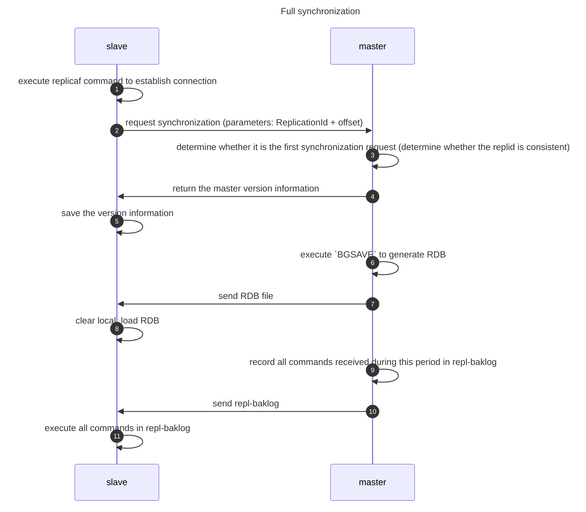
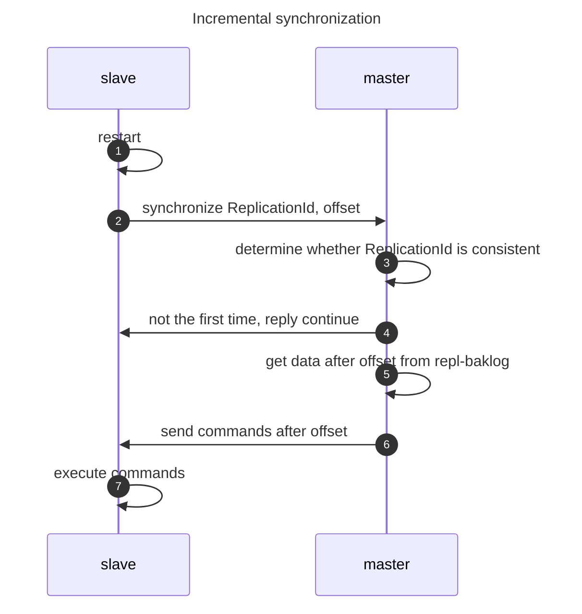

Redis is a very commonly used key-value database. The use of memory and HashMap for storage brings efficient queries. This article will introduce the persistence principle of Redis, the deployment method of clusters, and the expiration and elimination mechanism of key-value pairs.
<!-- more -->


[[TOC]]

## Persistence
The powerful performance of Redis is largely due to the fact that it stores all data in memory. However, after restarting, all the data in memory will be lost. In some cases, we hope that the data in Redis will not be lost after restarting, so Redis is involved There are two persistence strategies: RDB and AOF. Now let's take a look at the principles and advantages and disadvantages of these two strategies.

### RDB
RDB is a full backup based on snapshots, and the full amount of data is written to the snapshot file periodically. Redis will snapshot the data in the following situations:
- Snapshot according to the configuration rules.

	Users can customize several rules in the configuration file, and there is an "or" relationship between multiple rules. Each rule has two parameters: time window M and the number of changed keys N. For example:
	```text
	save 900 1
	save 300 10
	save 60 10000
	```
- The user executes the `SAVE` or `BGSAVE` command.

  - `SAVE`: When executing this command, Redis will perform a snapshot operation synchronously, during which all requests from the client will be blocked. If the amount of data is huge, Redis will be unresponsive for a long time, so this command should be avoided in the production environment.
  - `BGSAVE`: When we need to manually take a snapshot, it is recommended to use `BGSAVE`. This command can generate snapshots asynchronously in the background. If you want to know whether it is completed, you can use the `LASTSAVE` command to get the timestamp of the most recent successful snapshot.
- Execute the `FLUSHALL` command.

	When executing this command, Redis will clear all the data in the database. And regardless of whether the automatic snapshot condition is triggered during the clearing process, Redis will perform a snapshot operation as long as the snapshot condition is not empty. However, if the automatic snapshot condition is not defined, the execution of `FLUSHALL` will not take a snapshot.
- When performing replication (replication).

	When the [master-slave mode] (#Master-slave mode) is set, Redis will take a snapshot when the replication is initialized.

#### Snapshot principle
Redis will store the snapshot file in the dump.rdb file in the working directory of the current Redis process by default.
::: note The path and file name of the snapshot can be specified by the two parameters `dir` and `dbfilename`.
:::

The snapshot process is as follows:

::: steps
1. Redis uses the `fork` function to copy a copy (child process) of the current process (parent process).
2. The parent process continues to receive and process client requests, while the child process begins to write the data in memory to a temporary file on the hard disk.
3. When the child process writes all the data, it will replace the old RDB file with the temporary file. **At this point, a snapshot operation is completed**.
:::

::: tip When running the `fork()` function, Linux uses the copy-on-write strategy. When the parent process wants to change the data in it, the operating system will copy the data to ensure that the data of the child process is not affected. So the new RDB file stores the memory data at the moment of running the `fork()` function.
:::

#### Advantages and Disadvantages
::: tip Advantages
1. Fast recovery. Because it is a direct recovery of the full data.
2. The main process does not perform I/O, which has little impact on the node.
:::

::: warning Disadvantages
1. Loss interval. RDB It is a snapshot file. If the node crashes between two snapshots, the changes between the snapshots will be lost.
2. The old version is not compatible. The RDB file format is closely related to the Redis version. Different versions may not be able to use the same RDB for recovery.
3. The backup interval is too long. When the RDB is too large, the service may be suspended.
:::

### AOF
The AOF strategy records the instructions for memory modification. By default, Redis does not enable the AOF strategy. We can enable it through `appendonly yes`. After AOF is enabled, every time a command that changes Redis data is executed, Redis will write the command to the AOF file on the hard disk. The default file name is appendonly.aof file.

#### Rewrite
When the AOF file meets certain conditions, Redis will automatically rewrite the AOF file. The conditions can be customized in the configuration file:
```text
aoto-aof-rewrite-percentage 100
auto-aof-rewrite-min-size 64mb
```
`aoto-aof-rewrite-percentage` parameter means the current AOF file size exceeds the AOF file size at the last rewrite by a few percent. `auto-aof-rewrite-min-size` parameter limits the minimum AOF file size allowed to be rewritten.

::: tip Redis will delete redundant commands during the rewrite process.
:::

#### Advantages and Disadvantages
::: tip Advantages
1. No data loss will occur.

	Due to the cache mechanism of the operating system, the AOF command will not be directly written to the disk, but will enter the cache of the operating system and the operating system will decide when to synchronize to the disk. We can set the synchronization strategy through the appendfsync parameter:
   	- appendfsync always
   	- appendfsync everysec
   	- appendfsync no
	Among them, always means that each write will be synchronized, which is the slowest and safest. No means that the synchronization timing is completely determined by the operating system, and the performance is the best. But generally we will use everysec, which balances performance and safety.

2. No disk addressing overhead. Because the log is append-only.
3. The log is readable. This scenario can be used for emergency recovery. For example, after accidentally deleting important data, you can save the AOF before the file is updated.
:::

::: warning Disadvantages
1. AOF log is larger than RDB. Because AOF is a command file and RDB is a binary file.
2. Low performance. Because the backup interval is smaller.
3. Slow recovery. You need to execute the instructions in AOF once to recover.
:::

## Clustering
If it is some small projects, then using a Redis server may be completely sufficient. But in a real production environment, we usually need the support of several servers. This helps us avoid crashes caused by single point failures and performance limitations caused by a single machine. Redis supports three modes for cluster deployment: [Master-Slave](#master-slave-mode), [Sentinel](#sentinel-mode) and [Cluster](#cluster).

### Master-slave mode
Since there is an upper limit on the number of concurrent connections for a single server, we can use the master-slave mode to achieve read-write separation, thereby improving the efficiency of read-write. Usually, the master node performs write operations, and the slave node performs read operations.

In the master-slave mode, there is a problem of data synchronization between the master node and the slave node. Currently, Redis supports two different synchronization methods: **Full synchronization** and **Incremental synchronization**.

#### Full synchronization
Before understanding the process of full synchronization, let's first be familiar with several definitions within Redis:
1. ReplicationId: Data set tag, consistent id indicates that it is the same data set.
2. repl-baklog: command log file. It is mainly used to record the commands received by the master during the synchronization process from the time the master generates a snapshot to the time the slave copies the snapshot.
3. offset: the offset of repl-baklog. If the slave's offset is less than the master, it means that the version lags behind the master and needs to be updated.

The following is the process sequence diagram of full synchronization:


::: tip
Step 9 actually records the master between steps 6 and 10. All commands received.
:::

#### Incremental synchronization
After understanding full synchronization, let's compare the incremental synchronization process. Incremental synchronization is mainly used in scenarios where data changes occur after the slave node is restarted or later.


Incremental replication is implemented based on the following 3 points:
1. The slave database will store the RUN ID of the master database. Each Redis instance will have a unique ID, and a new RUN ID will be automatically generated when the instance is restarted.
2. During the replication synchronization phase, when the master database transmits each command to the slave database, it will store the command in a backlog queue and record the offset of the command currently stored in the backlog queue.
3. When the slave database receives the command from the master database, it will also record the offset of the command.

::: tip The criterion for judging whether the slave database uses full synchronization or incremental synchronization is whether the last successful synchronization command is in the backlog queue. If it is, incremental replication is performed; if not, full replication is performed.
:::

### Sentinel mode
Sentinel mode is mainly used to realize automatic recovery of master-slave clusters. There are three main functions:
1. ***Monitoring:*** Check whether the master and slave are working properly.
2. ***Automatic recovery:*** If the master fails, promote the slave to the master.
3. ***Notification:*** When a cluster fails over, the latest information is pushed to the Redis client.


#### Monitoring
Use the heartbeat mechanism to send a `ping` every 15 seconds to ensure that the node remains active. There are two cases of node offline:
1. ***Subjective offline:*** A node times out and does not respond.
2. ***Objective offline:*** Sentinels exceeding the threshold number consider a node offline. The threshold variable is `quorum`.

#### Master election
When the master node in Redis goes down, a voting machine similar to Raft will be used the master selection criteria are roughly based on the following:
1. The smaller the slave-priority.
2. The smaller the offset.
3. The smaller the running id.

### Cluster
Cluster is mainly used to deal with massive amounts of data, and has the following characteristics:
1. Multiple masters. Each master stores different data.
2. Each master has multiple slaves.
3. Masters use `ping` to detect health.
4. The client can access any node for reading and writing, and the request will be automatically forwarded to the correct node internally.

So if different masters store different data, how does Redis decide which node each data should be stored on? Redis uses slots, and there are a total of 16384 slots. The general process is: first calculate the Hash value based on the valid part of the key, then determine its slot position by taking the modulus of 16384, and then fetch the data.

As for why the number of slots is set to 16384, The author has made [formal reply](https://github.com/antirez/redis/issues/2576)
::: card title="why redis-cluster use 16384 slots?"
- Normal heartbeat packets carry the full configuration of a node, that can be replaced in an idempotent way with the old in order to update an old config. This means they contain the slots configuration for a node, in raw form, that uses 2k of space with16k slots, but would use a prohibitive 8k of space using 65k slots.
- At the same time it is unlikely that Redis Cluster would scale to more than 1000 mater nodes because of other design tradeoffs. So 16k was in the right range to ensure enough slots per master with a max of 1000 maters, but a small enough number to propagate the slot configuration as a raw bitmap easily. Note that in small clusters the bitmap would be hard to compress because when N is small the bitmap would have slots/N bits set that is a large percentage of bits set.
:::

## Expiration elimination mechanism
As the usage time of the Redis cluster continues to increase, the number of KVs stored in it increases, and the problem of insufficient memory will arise. Redis provides expiration and elimination strategies to manage massive amounts of data.

### Expiration strategy
As the name suggests, each data has a "lifespan" in Redis. When the set validity period has passed, the data will become invalid data and no longer support reading and writing. Redis provides two expiration strategies:
1. ***Periodic deletion:*** Randomly delete some expired keys every 100 ms. The reason for deleting only some here is that if a full scan is performed, Redis performance will be too low. If you want to adjust the scan interval, you can modify the parameter `h2`.
2. ***Lazy deletion:*** No regular scan is performed, only determine whether the key is expired when querying, and delete it if it is expired

In some additional scenarios, Redis will handle expired keys uniformly:
1. RDB generation and loading.
2. AOF writing and rewriting.
3. Master-slave synchronization.
In the above scenarios, expired keys will be filtered, that is, expired keys will not enter the snapshot file or be synchronized to the slave node.

### Elimination mechanism

| Serial number | Name            | Definition                                                                                              |
| ------------- | --------------- | ------------------------------------------------------------------------------------------------------- |
| 1             | volatile_LRU    | Execute the LRU algorithm in the key with an expiration time set                                        |
| 2             | allkeys-LRU     | Execute the LRU algorithm in all keys                                                                   |
| 3             | volatile_LFU    | Execute the LFU algorithm in the key with an expiration time set                                        |
| 4             | allkeys-LFU     | Execute the LFU algorithm in all keys (delete the least commonly used key)                              |
| 5             | volatile_random | Execute random deletion in the key with an expiration time set                                          |
| 6             | allkeys-random  | Execute random deletion in all keys                                                                     |
| 7             | volatile_TTL    | Delete the key with the earliest expiration time                                                        |
| 8             | noeviction      | Do not delete the key (**Default configuration, but this mode will not be used in normal development**) |

## Summary
- For persistence

	Redis supports two persistence strategies: RDB and AOF. RDB is a snapshot of data, while AOF is a log append write for data modification commands. Usually we will mix these two persistence modes in production environments.

- For deployment

	Redis supports three cluster deployment strategies: master-slave, sentinel and cluster. Usually in production environments we will use cluster to achieve better performance.

- For expiration elimination mechanism

	Redis uses periodic deletion and lazy deletion strategies, and provides a very rich elimination mechanism algorithm.